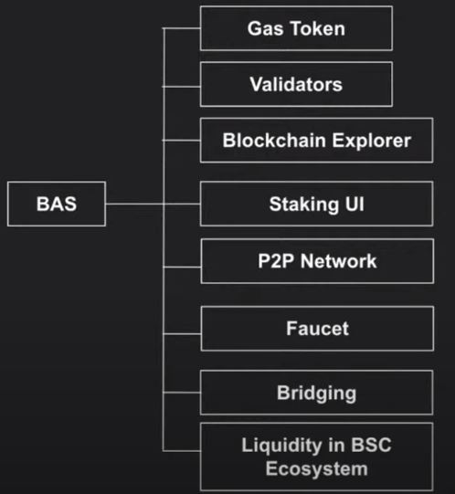

# When to Choose BAS
BNB Application Sidechains(BAS) is a Layer-2 scalability solution for the BSC ecosytem that is designed with better architecture and security in mind. The idea of BAS is to allow you to expand and reuse existing modules, and by using the architecture on smart contracts, painlessly modify existing contracts. It is a framework for creating sidechains in the BSC (BNB Smart Chain) ecosystem. It is an infrastructure to help developers and node operators build and run their own blockchains as their internal value system and for a massive number of users while still maintaining a close connection with the BSC. 

In essence, BAS defines the primary structure and configuration of the blockchain, using special templates. A template is a ready-made blockchain solution that is already integrated into the BSC infrastructure. With this integration, developers automatically get access to such useful products as a ready-made staking system, block explorer, SDK, API gateways, interfaces for governance, etc. 
The current implementation of BAS is based on a modified version of BSC, but this is not the rule, BAS can technically run on top of any blockchain. In the future, the list of templates will be extended. For more details, please refer to [Ankr documentation](https://docs.ankr.com/bnb-application-sidechain/architecture).

## When is it recommended to choose BAS?
BAS is recommended for large deentralized applications with more tha 100k Daily Active Users (DAUs). It is designed to be the go-to-choice for any application that wants to build its own chain with high speed, ultra-low gas fee, and its own gas token.

## Benefits of Choosing BAS

* ### **Own Your Own Blockchain and Gas Token**
  Earn gs fees and introduce more utility tokens. Have flexibility in designing your own validator set and tools. 

* ### **High TPS, Ultra Lowe Gas Fees, and Full EVM Compatibility**
Sustainable growth. Great user experience. Assurance of consistent performance on the network. 

* ### **Backed by the Largest Ecosystems by BSC and BAS**
BSC and BAS are seamlessly integrated and BSC DeFi/NFT liquidity and user base (>2M DAU ATH).

* ### **Free of Programming Lanaguages Constraints or API Standards**
BAS is a set of smart contracts written in any possible programming language. The contract executor itself can be anyone and work in any way; BAS does not require the use of any specific set of programming languages or API standards. 

## What will you get with BAS?

## How to Launch a BAS?
To launch a BAS, follow these steps defined in [Ankr documentation](https://docs.ankr.com/bnb-application-sidechain/how-to-launch-a-bas). Celer has also provided a [testnet BAS bridge]( https://test-bas-bridge.celer.network/#/transfer).
If you want to setup your own testnet, you can reach [NodeReal Support](https://docs.google.com/forms/d/e/1FAIpQLSer9JzrvzVzkpm4NsHPM1QzNMMZTfchehnTOY8CSysI0RvVAQ/viewform) or [Ankr](https://docs.ankr.com/blockchain-apis/getting-support) to get professional support there. 

### Testnets
There are two testnets where you can try BAS. It already contains pre-deployed API gateways, block explorer, UI for the staking, and a faucet.
Ankr Testnet: [Ankr documentation](https://docs.ankr.com/bnb-application-sidechain/demo).
NodeReal Testnet: NodeReal [Testnet blog](https://medium.com/@NodeReal/build-your-gamefi-on-bas-aries-testnet-bf54dd99b959) and [documentation](https://docs.nodereal.io/nodereal/bas/wallet/use-metamask-for-bas).

## FAQ
For more questions, refer to [Ankr documentation](https://docs.ankr.com/bnb-application-sidechain/faq).

