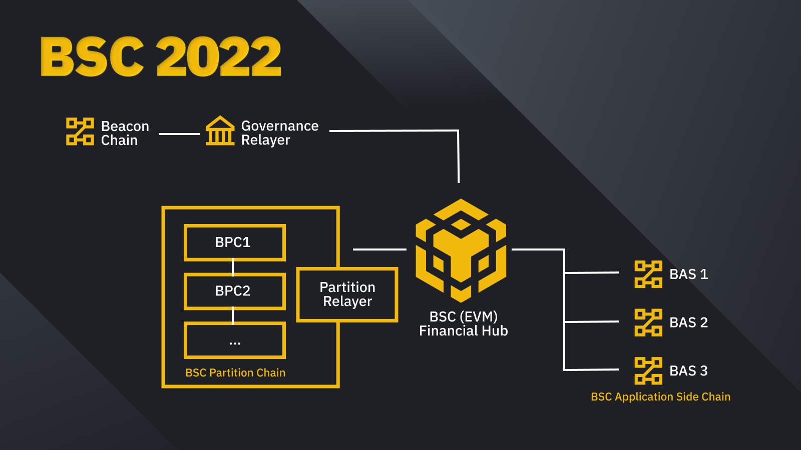

# Introduction 
In 2017, Binance and BNB were born. Three years later, Binance Smart Chain (BSC) was introduced to the world.  As Binance grew bigger and stronger, so did Binance Smart Chain.  BSC was born in time for the DeFi revolution, as the public showed increased interest in alternative financial solutions and use cases powered by blockchain. Today, both Binance and BSC remain connected by BNB.
However, with ever growing user base and multiple use-cases like GameFi, DeFi, MetaFi, etc.,  and for the BNB token to reach its true potential, Binance Chain and Binance Smart Chain (BSC) have been rebranded to become **BNB Chain**.

## What is Build N Build (BNB) Chain?
BNB Chain is comprised of:
1. **[BNB Beacon Chain](learn/beaconIntro.md) _(previously Binance Chain)_** - BNB Chain Governance (Staking, Voting)
2. **[BNB Smart Chain (BSC)](learn/intro.md) (_Previously Binance Smart Chain)_** - EVM compatible, consensus layers, and with hubs to multi-chains

## BNB Token
BNB (formerly known as Binance Coin) stands for “**Build and Build**”. Along with _fueling_ transactions on BNB Chain (similar to gas on Ethereum), BNB also acts as a governance token. Holding BNB gives you the right to make your voice heard and is necessary to participate in BNB Chain’s decentralized on-chain governance. With this name change also comes more advancements to benefit users, projects and developers connected to the BNB Chain community. Over the past year, the BNB Chain community has made even further technical upgrades for progressive decentralization, including:
- Initiating the Bruno hard fork to increase the BNB burn rate.
- A new BNB Auto-Burn protocol that is objective and verifiable

## Key Features
BSC 2021 (current version) introduces a considerable block size of **__100m gas ceiling__**.
 the blockchain storage and BSC client should introduce a more advanced logic to cover it and allow further expansion.  Currently, to fully sync the BSC blockchain, validators need extensive storage and time. Scaling down the validator and node operator requirements is necessary to enable a seamless BSC experience.

- New technologies, like Erigon, are being verified to decrease both time and storage demands for validators nodes while performing full sync. 
- Working with validators and infrastructure providers to deploy new solutions to address this issue, such as  
  - Parallel EVM
  - Better block process pipeline
  - Improved state caching
  - Fast sync mode
  - Distributed nodes 
  - 20 more validators to join the block production of BSC 2022

## Future Goal 
Innovation never sleeps, and it’s clear that the future goes Beyond Binance into a world of over 1 billion users. MetaFi is also a key part of this too, helping to create a future where interoperability makes lives easier. BNB Chain’s mission is to build the infrastructure powering the world’s parallel virtual ecosystem, and BNB Chain’s commitment to the community is that it will be: 
- Open
- Multi-chain
- For creators and inventors
- Permissionless
- Forever decentralized