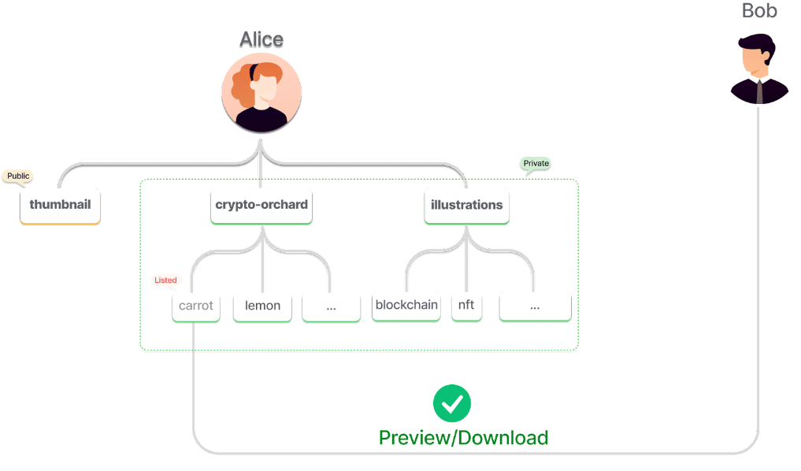
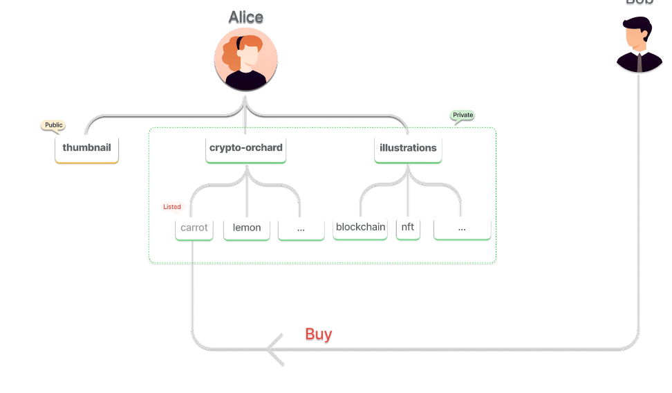
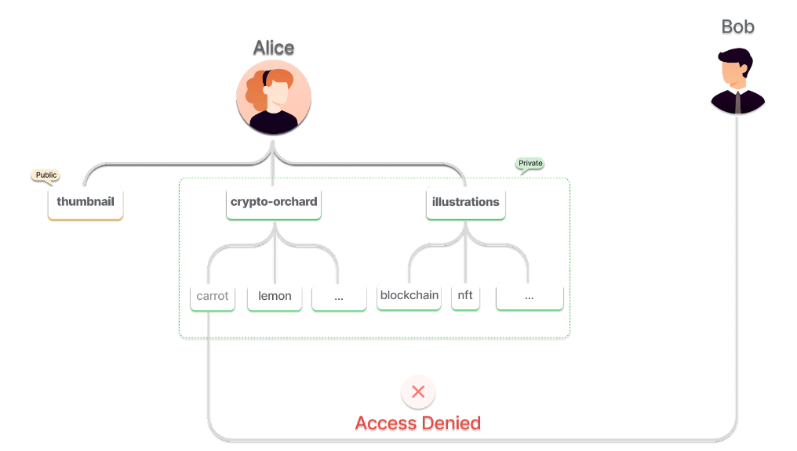

# Data Marketplace with Programmable Access Control


## Introduction

BNB Greenfield introduces an entirely new structural and economic paradigm for data in the Web3 era. The ownership, usage and monetization of data is now possible first and foremost for users, as well as all participants in the BNB Chain ecosystem.

In this tutorial, we will learn to build a data marketplace with programmable access control.

## Data Marketplace Workflow

Data marketplace is a data exchange platform where users can freely create, list, trade, and sell data assets, including digital publications, scientific experimental data, and specific domain data.

In this tutorial, we have to solve the question: How can Alice share/sell her private files to Bob?



The Greenfield Blockchain offers a comprehensive set of resources, including buckets, objects, and groups, which can be mirrored on the BNB Smart Chain (BSC) as non-fungible tokens (NFTs) adhering to the ERC-721 standard. Buckets serve as logical containers for storing objects, where an object represents a fundamental storage unit containing data and metadata. Groups are collections of accounts with similar permissions. These resources, along with group members' permissions as ERC-1155 tokens, can be mirrored on the BSC. Currently, these NFTs are non-transferable but will gain transferability in the near future. Smart contracts on BSC can directly manage these mirrored resources, impacting storage formats, access permissions, and other data aspects on Greenfield. This integration enhances flexibility and accessibility, streamlining and optimizing data management across both platforms.

To learn more about the **mirroring** implementation details, please read [this doc](../../guide/core-concept/cross-chain/mirror.md)


To solve her problem with resource mirroring, Alice should complete the following:




1. Create a group on Greenfield
2. Bind group with object or bucket on Greenfield
3. Mirror the group to BSC
4. Approve the data marketplace smart contract to operate her group
5. List the group on BSC data marketplace smart contract, setting price


To access data asset from BSC



## Greenfield Contract SDK

The [Smart Contract SDK](https://github.com/bnb-chain/greenfield-contracts-sdk), designed to facilitate the development of community-driven projects. The SDK serves as an upper layer wrapper for the
[Greenfield-Contracts](https://github.com/bnb-chain/greenfield-contracts) library, which implements the cross-chain communication functionality. By providing a user-friendly interface to the underlying interface, the SDK simplifies the development process and enables developers to create and manage a variety of greenfield resources, like bucket, group, and object on BSC through smart contract directly.

To learn more about the mirroring implementation details, please read [this doc](../../guide/core-concept/cross-chain/sdk.md) and [Primitive Interfaces](../../guide/core-concept/cross-chain/interface.md)


## Ebook Data Marketplace Example

We will walk you through the process of creating a decentralized ebook marketplace using the Contract SDK
as an example.

### Prerequisites

Before starting, make sure you have the following tools installed:

- [Node.js](https://nodejs.org/)
- [Foundry](https://book.getfoundry.sh/)

### Installation

```console
$ npm install @bnb-chain/greenfield-contracts-sdk
```

Alternatively, you can obtain the contracts directly from the GitHub repository (`bnb-chain/greenfield-contracts-sdk`). When doing so, ensure that you specify the appropriate release.

#### Steps

1. Import the desired contracts, for example in `examples/ebook-shop.sol`:

   ```solidity
   pragma solidity ^0.8.0;

   import "@bnb-chain/greenfield-contracts-sdk/BucketApp.sol";
   import "@bnb-chain/greenfield-contracts-sdk/ObjectApp.sol";
   import "@bnb-chain/greenfield-contracts-sdk/GroupApp.sol";
   import "@bnb-chain/greenfield-contracts-sdk/interface/IERC1155.sol";
   import "@bnb-chain/greenfield-contracts-sdk/interface/IERC721NonTransferable.sol";
   import "@bnb-chain/greenfield-contracts-sdk/interface/IERC1155NonTransferable.sol";
   ...

   contract EbookShop is BucketApp, ObjectApp, GroupApp {
   	...
   }
   ```

2. Define the `initialize` function. Initialize the global variables in the init function. You can use the internal init functions:
   ```solidity
   function initialize(
       address _crossChain,
       address _bucketHub,
       address _objectHub,
       address _groupHub,
       address _ebookToken,
       address _paymentAddress,
       uint256 _callbackGasLimit,
       address _refundAddress,
       uint8 _failureHandleStrategy,
       ...
   ) public initializer {
       __base_app_init_unchained(_crossChain, _callbackGasLimit, _refundAddress, _failureHandleStrategy);
       __bucket_app_init_unchained(_bucketHub);
       __group_app_init_unchained(_groupHub);
       __object_app_init_unchained(_objectHub);

       ...
   }
   ```

3. Define and override the `greenfieldCall`, `retryPackage` and `skipPackage` functions if your dApp needs callback. You can route calls with the help of the internal method:
   ```solidity
   function greenfieldCall(
       uint32 status,
       uint8 resoureceType,
       uint8 operationType,
       uint256 resourceId,
       bytes calldata callbackData
   ) external override(BucketApp, ObjectApp, GroupApp) {
       require(msg.sender == crossChain, string.concat("EbookShop: ", ERROR_INVALID_CALLER));

       if (resoureceType == RESOURCE_BUCKET) {
           _bucketGreenfieldCall(status, operationType, resourceId, callbackData);
       } else if (resoureceType == RESOURCE_OBJECT) {
           _objectGreenfieldCall(status, operationType, resourceId, callbackData);
       } else if (resoureceType == RESOURCE_GROUP) {
           _groupGreenfieldCall(status, operationType, resourceId, callbackData);
       } else {
           revert(string.concat("EbookShop: ", ERROR_INVALID_RESOURCE));
       }
   }

   function retryPackage(uint8 resoureceType) external override onlyOperator {
       if (resoureceType == RESOURCE_BUCKET) {
           _retryBucketPackage();
       } else if (resoureceType == RESOURCE_OBJECT) {
           _retryObjectPackage();
       } else if (resoureceType == RESOURCE_GROUP) {
           _retryGroupPackage();
       } else {
           revert(string.concat("EbookShop: ", ERROR_INVALID_RESOURCE));
       }
   }

   function skipPackage(uint8 resoureceType) external override onlyOperator {
       if (resoureceType == RESOURCE_BUCKET) {
           _skipBucketPackage();
       } else if (resoureceType == RESOURCE_OBJECT) {
           _skipObjectPackage();
       } else if (resoureceType == RESOURCE_GROUP) {
           _skipGroupPackage();
       } else {
           revert(string.concat("EbookShop: ", ERROR_INVALID_RESOURCE));
       }
   }
   ```

4. Next you need to define the main functional parts of the app. You can send cross-chain request to system contracts with the help of internal functions like below:
   ```solidity
   /**
    * @dev Create a new series.
    *
    * Assuming the sp provider's info will be provided by the front-end.
    */
   function createSeries(
       string calldata name,
       BucketStorage.BucketVisibilityType visibility,
       uint64 chargedReadQuota,
       address spAddress,
       uint256 expireHeight,
       bytes calldata sig
   ) external payable {
       require(bytes(name).length > 0, string.concat("EbookShop: ", ERROR_INVALID_NAME));
       require(seriesId[name] == 0, string.concat("EbookShop: ", ERROR_RESOURCE_EXISTED));

       bytes memory _callbackData = bytes(name); // use name as callback data
       _createBucket(msg.sender, name, visibility, chargedReadQuota, spAddress, expireHeight, sig, _callbackData); // send cross-chain request
   }

   /**
    * @dev Provide an ebook's ID to publish it.
    *
    * An ERC1155 token will be minted to the owner.
    * Other users can buy the ebook by calling `buyEbook` function with given price.
    */
   function publishEbook(uint256 _ebookId, uint256 price) external {
       require(
           IERC721NonTransferable(objectToken).ownerOf(_ebookId) == msg.sender,
           string.concat("EbookShop: ", ERROR_INVALID_CALLER)
       );
       require(ebookGroup[_ebookId] != 0, string.concat("EbookShop: ", ERROR_GROUP_NOT_EXISTED));
       require(price > 0, string.concat("EbookShop: ", ERROR_INVALID_PRICE));

       ebookPrice[_ebookId] = price;
       IERC1155(ebookToken).mint(msg.sender, _ebookId, 1, "");
   }

   /**
    * @dev Provide an ebook's ID to buy it.
    *
    * Buyer will be added to the group of the ebook.
    * An ERC1155 token will be minted to the buyer.
    */
   function buyEbook(uint256 _ebookId) external payable {
       require(ebookPrice[_ebookId] > 0, string.concat("EbookShop: ", ERROR_EBOOK_NOT_ONSHELF));

       uint256 price = ebookPrice[_ebookId];
       require(msg.value >= price, string.concat("EbookShop: ", ERROR_NOT_ENOUGH_VALUE));

       IERC1155(ebookToken).mint(msg.sender, _ebookId, 1, "");

       uint256 _groupId = ebookGroup[_ebookId];
       address _owner = IERC721NonTransferable(groupToken).ownerOf(_groupId);
       address[] memory _member = new address[](1);
       _member[0] = msg.sender;
       _updateGroup(_owner, _groupId, UPDATE_ADD, _member);
   }

   /**
    * @dev Provide an ebook's ID to downshelf it.
    *
    * The ebook will be removed from the shelf and cannot be bought.
    * Those who have already purchased are not affected.
    */
   function downshelfEbook(uint256 _ebookId) external {
       require(
           IERC721NonTransferable(objectToken).ownerOf(_ebookId) == msg.sender,
           string.concat("EbookShop: ", ERROR_INVALID_CALLER)
       );
       require(ebookPrice[_ebookId] > 0, string.concat("EbookShop: ", ERROR_EBOOK_NOT_ONSHELF));

       ebookPrice[_ebookId] = 0;
   }
   ...
   ```

5. Besides, you may need to provide a function for user to register their own resource that were created at greenfield side and then mirrored to BSC manually:
   ```solidity
   /**
    * @dev Register bucket resource that mirrored from GreenField to BSC.
    */
   function registerSeries(string calldata name, uint256 tokenId) external {
       require(
           IERC721NonTransferable(bucketToken).ownerOf(tokenId) == msg.sender,
           string.concat("EbookShop: ", ERROR_INVALID_CALLER)
       );
       require(bytes(name).length > 0, string.concat("EbookShop: ", ERROR_INVALID_NAME));
       require(seriesId[name] == 0, string.concat("EbookShop: ", ERROR_RESOURCE_EXISTED));

       seriesName[tokenId] = name;
       seriesId[name] = tokenId;
   }
   ...
   ```

6. Define other view functions, internal functions and access control system according to your own needs.


## Source Code
- Frontend: `https://github.com/bnb-chain/greenfield-data-marketplace-frontend`
- Smart Contracts: `https://github.com/bnb-chain/greenfield-data-marketplace-contracts`

## Deployments
- [Data Marketplace BSC Mainnet Demo](https://marketplace.greenfield-sp.bnbchain.org/index.html)
- [Data Marketplace BSC Testnet Demo](https://marketplace.greenfield-sp.bnbchain.org/bsc-testnet.html)
- [Data Marketplace opBNB Testnet Demo](https://marketplace.greenfield-sp.bnbchain.org/opbnb-testnet.html)