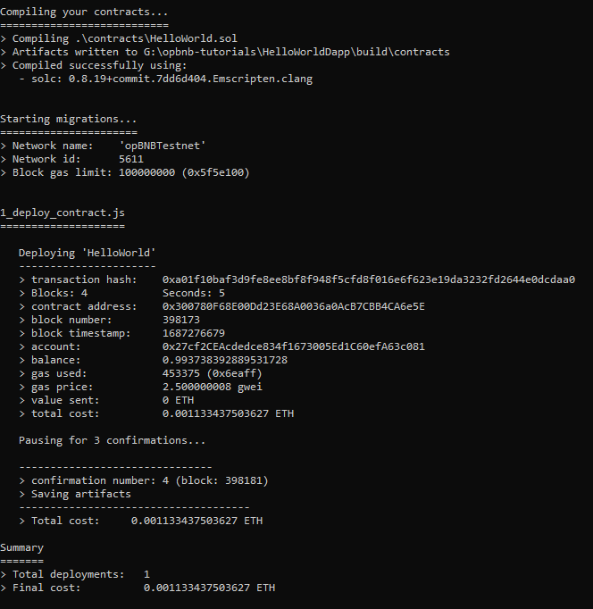
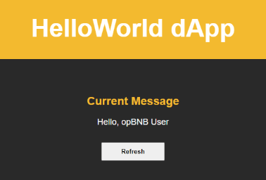

# Create a Full Stack dapp using Truffle and React on opBNB

In this tutorial, we'll deploy a simple HelloWorld smart contract on opBNB and build a Web3 frontend using React to interact with the deployed smart contract, i.e., read from and write to the opBNB blockchain.

## What are we building

opBNB is essentially an optimized layer-2 solution that delivers lower fees and higher throughput to unlock the full potential of the BNB Chain.

For this tutorial, we will deploy a simple `HelloWorld` smart contract on the opBNB network and build a frontend using Reactjs to interact with the deployed smart contract for reading and writing data onto the opBNB blockchain.
The `HelloWorld` smart contract is a simple string variable message that will be used for storing the user-defined messages, e.g., `Hello, opBNB User`. The `updateMessage` function will be used for updating the message variable to any user-defined string value.

This smart contract will then be deployed on the opBNB network using [Truffle IDE](https://trufflesuite.com/). We will then use the [Reactjs boilerplate](https://create-react-app.dev/) to build a front end to communicate with the smart contract. [Web3.js library](https://web3js.readthedocs.io/en/v1.10.0/#) is used for interacting with the smart contract and reading and writing data to the opBNB blockchain. We further use [Metamask](https://metamask.io/) for signing transactions and paying any gas costs.

*This is a basic example for educational purposes, and it assumes familiarity with [Truffle](https://trufflesuite.com/), [React](https://react.dev/), and [MetaMask](https://metamask.io/).*

## Learning Takeaways

By the end of this tutorial, you will be able to achieve the following

- Use Truffle IDE to spin up a project template and write, compile, and deploy a simple smart contract on the opBNB.
- Create a front end for interacting with the deployed smart contract using ReactJS.
- Interact with smart contracts deployed on opBNB via ReactJS frontend using Web3.js library.

## Pre-requisites

- [Node.js (Node v18.14.2)](https://nodejs.org/en/download/)
- [Metamask Web Wallet](https://metamask.io/)
- [Truffle v5.10.0](https://trufflesuite.com/docs/truffle/how-to/install/)
- Get tBNB in your Metamask wallet configured with opBNB Testnet
  - [Metamask Wallet Configuration for opBNB.](https://docs.bnbchain.org/opbnb-docs/docs/build-on-opbnb/wallet-configuration)
  - [Deposit tBNB to your opBNB account](https://docs.bnbchain.org/opbnb-docs/docs/build-on-opbnb/deposit-to-opbnb)

## Demo Step-by-Step Guide

For this tutorial, we will be using Truffle IDE to develop, compile and deploy a simple `HelloWorld` smart contract on the opBNB network. For building the front end, we will be using the `create-react-app` React boilerplate. Further, to connect our dapp to the web3 world, we will be using the Metamask wallet.

### Step 1: Set up the project

1. Make sure you have Node.js and npm installed on your machine.

2. Install Truffle globally by running the following command

```shell
npm install -g truffle
```

3. Create a new directory for your project and navigate into it

```shell
mkdir HelloWorldDapp
cd HelloWorldDapp
```

4. Initialize a new Truffle project. Create a [bare Truffle project](https://trufflesuite.com/docs/truffle/getting-started/creating-a-project.html) which generates the required directory structure to test and deploy contracts:

```shell
truffle init
```

Truffle creates the following directory structure for your project:

- `contracts/`: directory for your [Solidity contracts](https://trufflesuite.com/docs/truffle/getting-started/interacting-with-your-contracts).
- `migrations/`: directory for the [scriptable deployment files](https://trufflesuite.com/docs/truffle/getting-started/running-migrations#migration-files).
- `test/`: directory for files that [test your application and contracts](https://trufflesuite.com/docs/truffle/testing/testing-your-contracts).
- `truffle-config.js`: the Truffle [configuration file](https://trufflesuite.com/docs/truffle/reference/configuration).

5. Install Create React App globally by running the following command

   ```shell
   npm install -g create-react-app
   ```

6. Create the React app frontend using the following command

   ```shell
   npx create-react-app frontend
   ```

7. Navigate into the client directory using the following command

   ```shell
   cd frontend
   ```

### Step#2: Install `hdwallet-provider​`

`hdwallet-provider` is a separate package that signs transactions for addresses derived from a 12 or 24-word mnemonic. By default, the `hdwallet-provider` uses the first address generated from the mnemonic. However, this is configurable. For more information, refer to the Truffle `hdwallet-provider` repository. Run the following command to install `hdwallet-provider`

```shell
    npm install @truffle/hdwallet-provider
```

### Step#3: Create the `.env` file​

- Install the `dotenv` package using the following command

```shell
    npm install dotenv
```

- Create a file named `.env` in your project directory to store the Metamask Secret Phrase. Refer to the MetaMask instructions on [how to reveal a secret recovery phrase](https://metamask.zendesk.com/hc/en-us/articles/360015290032-How-to-Reveal-Your-Seed-Phrase).

```js
MNEMONIC = "<Your-MetaMask-Secret-Recovery-Phrase>";
```

- Ensure you replace the following values in the `.env` file
  - `<Your-MetaMask-Secret-Recovery-Phrase>` with the mnemonic of your MetaMask wallet. This phrase is used by the [Truffle hdwallet-provider](https://github.com/trufflesuite/truffle/tree/develop/packages/hdwallet-provider) to sign transactions.


*Never disclose your secret recovery phrase. Anyone with your recovery phrase can steal any assets held in your wallet.*


### Step#4: Create the smart contract

Inside the contracts directory, create a new file named `HelloWorld.sol` and add the following code

```jsx
   // SPDX-License-Identifier: MIT
   pragma solidity ^0.8.19;

   contract HelloWorld {
       string public message;

       constructor(string memory _message) {
           message = _message;
       }

       function updateMessage(string memory _newMessage) public {
           message = _newMessage;
       }
   }
```

### Step#5: Configure Truffle for use with opBNB

1. Open the `truffle-config.js` file and add the following code:

```jsx
const HDWalletProvider = require("@truffle/hdwallet-provider");
// create a file at the root of your project and name it .env -- there you can set process variables
// like the mnemonic etc. Note: .env is ignored by git to keep your private information safe

require("dotenv").config();

const mnemonic = process.env["MNEMONIC"].toString().trim();

module.exports = {
  networks: {
    development: {
      host: "127.0.0.1", // Localhost (default: none)
      port: 8545, // Standard Ethereum port (default: none)
      network_id: "*", // Any network (default: none)
    },
    opBNBTestnet: {
      provider: () =>
        new HDWalletProvider(
          mnemonic,
          `https://opbnb-testnet-rpc.bnbchain.org`
        ),
      network_id: 5611,
      confirmations: 3,
      timeoutBlocks: 200,
      skipDryRun: true,
    },
  },

  // Set default mocha options here, use special reporters etc.
  mocha: {
    // timeout: 100000
  },

  // Configure your compilers
  compilers: {
    solc: {
      version: "0.8.19",
    },
  },
};
```

### Step#6: Deploy the smart contract on opBNB

1. In the root directory of your project, create a new file named `1_deploy_contract.js` inside the `migrations` directory and add the following code:

```jsx
const HelloWorld = artifacts.require("HelloWorld");

module.exports = function (deployer) {
  deployer.deploy(HelloWorld, "Hello, World!");
};
```

2. Deploy the smart contract to the opBNB testnet by running the following command

```shell
truffle migrate --network opBNBTestnet
```



### Step#7: Set up the React frontend

1. Inside the `frontend/src` directory, replace the contents of the `App.js` file with the following code:

```jsx
import React, { useEffect, useState } from "react";
import Web3 from "web3";
import HelloWorldContract from "./contracts/HelloWorld.json";
import "./App.css";

function App() {
  const [contract, setContract] = useState(null);
  const [message, setMessage] = useState("");
  const [newMessage, setNewMessage] = useState("");
  const [loading, setLoading] = useState(false);

  useEffect(() => {
    const loadBlockchainData = async () => {
      try {
        const web3 = new Web3(window.ethereum);
        const networkId = await web3.eth.net.getId();
        const deployedNetwork = HelloWorldContract.networks[networkId];
        const instance = new web3.eth.Contract(
          HelloWorldContract.abi,
          deployedNetwork && deployedNetwork.address
        );
        setContract(instance);
      } catch (error) {
        console.error(error);
      }
    };

    loadBlockchainData();
  }, []);

  const getMessage = async () => {
    if (contract) {
      try {
        setLoading(true);
        const message = await contract.methods.message().call();
        setMessage(message);
      } catch (error) {
        console.error(error);
      } finally {
        setLoading(false);
      }
    }
  };

  const updateMessage = async () => {
    if (contract && newMessage !== "") {
      try {
        setLoading(true);
        await contract.methods
          .updateMessage(newMessage)
          .send({ from: (await window.ethereum.enable())[0] });
        setNewMessage("");
      } catch (error) {
        console.error(error);
      } finally {
        setLoading(false);
      }
    }
  };

  return (
    <div className="App">
      <h1 className="header">HelloWorld dApp</h1>
      <div className="content">
        <div className="message">
          <h2>Current Message</h2>
          <p className="messageValue">{loading ? "Loading..." : message}</p>
          <button onClick={getMessage}>Refresh</button>
        </div>
      </div>
      <div className="content">
        <div className="update">
          <h2>Update Message</h2>
          <input
            type="text"
            placeholder="New Message"
            value={newMessage}
            onChange={(e) => setNewMessage(e.target.value)}
            className="inputMessage"
          />
          <br />
          <button onClick={updateMessage}>Update</button>
        </div>
      </div>
    </div>
  );
}

export default App;
```

2. Replace the contents of the `App.css` file with the following code:

```css
.App {
  text-align: center;
}

.header {
  background-color: #f3ba2f;
  min-height: 20vh;
  display: flex;
  flex-direction: column;
  align-items: center;
  justify-content: center;
  font-size: calc(40px + 2vmin);
  color: white;
}

.content {
  display: flex;
  justify-content: center;
  align-items: center;
  padding: auto;
  text-align: center;
}

.message,
.update {
  padding: auto;
  margin: 20px;
}
.messageValue {
  color: whitesmoke;
  font-size: large;
}

.inputMessage {
  float: center;
  padding: 10px;
  width: 100%;
  font-family: "IBM Plex Sans", "Raleway", "Source Sans Pro", "Arial";
}

button {
  float: center;
  margin: 1em 0;
  padding: 10px 3em;
  font-weight: bold;
  max-width: fit-content;
  font-family: "IBM Plex Sans", "Raleway", "Source Sans Pro", "Arial";
}

body {
  background-color: #292929;
  color: #f3ba2f;
  align-items: center;
  font-family: "IBM Plex Sans", "Raleway", "Source Sans Pro", "Arial";
  -webkit-font-smoothing: antialiased;
  -moz-osx-font-smoothing: grayscale;
}
```

### Step 6: Start the development server

1. In the frontend directory, install the required dependencies by running the following command

```shell
npm install
```

2. Start the React development server:

```shell
npm start
```

3. Visit `http://localhost:3000` in your browser, and you should see the `HelloWorld` dApp with the current message and the ability to update it.

*Make sure you have the MetaMask extension installed and set to the opBNB testnet.*


4. When you enter a new message and click the update button, if your dapp is already not connected to Metamask wallet, you will get a Metamask notification asking for permission to connect your wallet to the dapp.


5. It will also ask for your confirmation to confirm the transaction. Proceed by clicking the confirm button.


6. Once the transaction is confirmed, click the `Refresh` button to load the new message.



## Conclusion

In this tutorial, we provided a step-by-step guide on how to develop, deploy, and interact with a smart contract on the opBNB network. We used the Truffle IDE for compiling and deploying the smart contract. We also build a React frontend to interact with the deployed smart contract, i.e., read from and write to the opBNB blockchain.

