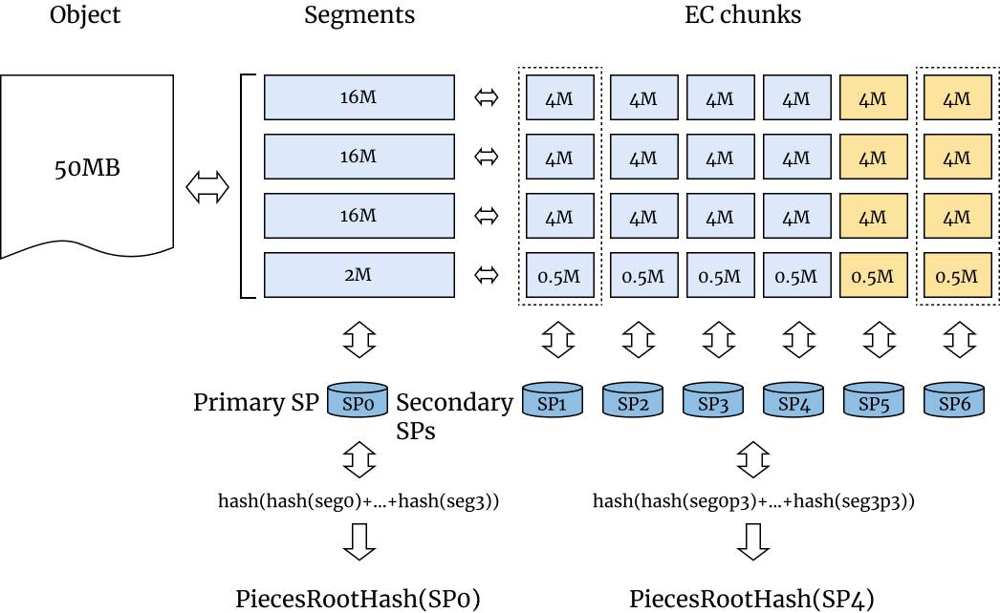
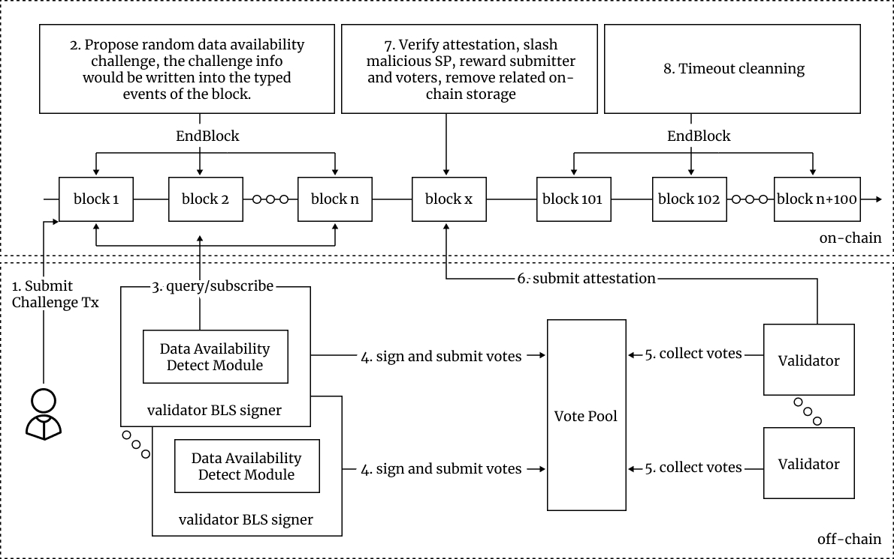

# Data Availability Challenge

It is always the first priority of any decentralized storage network to
guarantee data integrity and availability. Many of the existing
solutions rely on intensive computing to generate proofs. However,
Greenfield chooses the path of social monitoring and challenges.

The holistic target for Greenfield is to ensure that the storage provider(SP) stores the data as expected are as below:

   **a.** The primary SP splits the original object that the user uploads into segments correctly.

   **b.** The primary SP encodes the segments into redundant Erasing Code pieces correctly, and distributes them to the secondary SP as agreed.

   **c.** The SP stores assigned pieces either as the role of primary SP or secondary SP correctly, and the data pieces stored should not be corrupted or falsified.

A user needs to ensure that the object stored on Greenfield is really
his object without downloading the whole object and comparing the
contents. And also, each SP should store the correct piece for each
object as required, and this information should be verified on the
Greenfield blockchain. A special metadata structure is introduced for
every object for data challenges as below:

```go
type ObjectInfo struct {
    …
    root         Hash  // primary SP object root, the hash of segments' hashes
    subRootList []hash //secondary SP object root, the hash of local pieces' hashes
    …
}
```

Each storage provider will keep a local manifest for the pieces of each
object that are stored on it. For the primary SP, the local manifest
records each segment's hashes. The `root` field of the object's
metadata in the above code stores the hash of the whole local manifest
of the primary SP, e.g., it is the `PiecesRootHash(SP0)` in the below
diagram. For the secondary SPs, the local manifest records each piece's
hashes, and the hash of their local manifest files are recorded in the
subRooList field in order, e.g. the 4th element of this list will store
the 4th secondary SP's `PiecesRootHash(SP4)` in the below diagram.


<div align="center"><i>Hashes for Data Integrity</i></div>

These root hashes serve as the checksum for the data segments and
redundancy pieces.

## The Initial Data Integrity and Redundancy Metadata

The user-side client software will perform some work:

   **1.** Split the object file into segments if necessary;

   **2.** Compute the root hash across all the segments;
   
   **3.** Compute the EC and calculate the hashes for the parity pieces;
   
   **4.** Send transactions to the Greenfield blockchain to request creating the object with the above information.

Besides sending the information to the Greenfield blockchain, the client
software also sends the same to the primary SP and uploads the payload
data onto it. For the primary SP stores the original segments of the
object, the SP has to verify the root hash to check the integrity of the
segment. The SP also has to compute the EC pieces by itself and verify
the hash. All the hashes will be recorded on a manifest file stored
locally with the SP, and the root hash of the file will be submitted to
the Greenfield blockchain in the "Seal" transaction. Greenfield
blockchain will verify the hashes in the Seal transaction against the
object creation request transaction to ensure data integrity as they are
the agreed value across Primary SPs and the users.

These hashes and the corresponding manifest files will be used to verify
the data in the data availability challenge as described below.

## Data Availability Challenge Process


<div align="center"><i>Data Availability Challenge</i></div>

This data availability challenge is illustrated in figure 19.2 above.

The Greenfield validators have the responsibility to verify the data
availability from the SPs. They form a voting committee to execute this
task by the incentive of fees and potential fines (slashes) on SPs.

A multi-signing logic, e.g., BLS-based multi-sig, is used to reach
another level of off-chain consensus among the Greenfield validators.
When the validator votes for the data challenge, they co-sign an
attestation and submit on-chain.

The overall data availability challenge mechanism works as below:

**1.** Anyone can submit a transaction to challenge data availability. The challenge information will be written into the on-chain event triggered after the transaction is processed.

**2.** The second way to trigger the challenge is more common: at the end of the block process phase of each block, Greenfield will use a random algorithm to generate some data availability challenge events. All challenge information will be persisted on the chain until the challenge has been confirmed or expired.

**3.** Each validator should run an off-chain data availability check module. This program keeps tracking the on-chain challenge information and then initiates an off-chain data availability check. It checks whether a data piece is available in the specified SP in response to the challenge event, no matter whether the event is triggered by the individual challenger or the Greenfield chain itself. There are three steps to perform the

   * **Check:**
      
      **1.** Ask the challenged SP for this data piece and the local manifest of the object. If the expected data can't be downloaded, the piece should be regarded as unavailable.
      
      **2.** Compute the hash of the local manifest, and compare it with the related root hash that is recorded in the metadata of the
      object. If they are different, the piece should be regarded as
      unavailable.
      
      **3.** Compute the checksum hash of the challenged piece, and compare it with the related checksum that is recorded in the local
      manifest. If they are different, the piece should be regarded
      as unavailable.

      Any of the above "**unavailable**" cases will mark the challenge success that the data is unavailable, and the validator will vote "**unavailable**".

**4.** The validator uses its BLS private key to sign a data challenge vote according to the result. The data to vote should be the same for all validators to sign: it should include the block header of the block that contains the challenge, data challenge information, and the challenge result.

**5.** The data availability challenge votes are propagated through the P2P network.

**6.** Once a validator collects an agreement from more than 2/3 validators, an "attestment" is concluded. The validator can aggregate the signatures, assemble data challenge attestation, and submit an attestation transaction. In order to solve the concern that validators may just follow the others' results and not perform the check themselves, a "**commit-and-reveal**" logic will be introduced.

**7.** The data challenge attestation transaction will be executed on-chain. The first validator who submits the attestation can get a submission reward, while the later submission will be rejected. The more votes the submitter aggregates, the more reward it can get. Besides the submission rewards, there are attestment rewards too. Only the validators whose votes wrapped into the attestation will be rewarded, so it may be that some validators voted, but their votes were not assembled by the validator. They won't get rewarded for these data availability challenges. Also, for different results, the rewards will be different: the "unavailable" result that slashes the SPs will get validators more rewards.

**8.** After a number of blocks, for example, 100 blocks, the data availability challenge will expire even if the submissions of  attestments haven't arrived. In such a case, the challenge will just expire with no further actions.

**9.** Once a case of data availability is successfully challenged, i.e. the data is confirmed not available with quality service, there will be a cooling-off period for the SPs to regain, recover, or shift this piece of data.

**10.** Once the cooling-off period time expires, this data availability can be challenged again if this piece of data is still unavailable, the SP would be slashed again.

