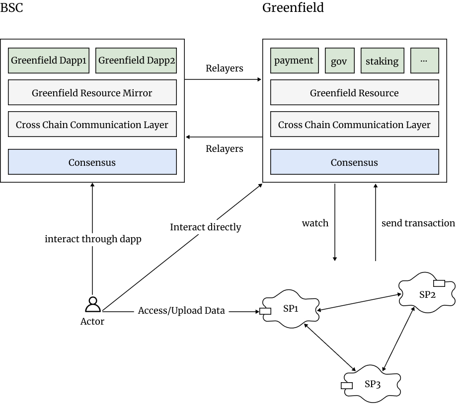

# Ecosystem Players

There are several player roles for the whole Greenfield ecosystem.

<i>All Players of Greenfield</i>

## Greenfield Validators

As a PoS blockchain, the Greenfield blockchain has its own validators.
These validators are elected based on the Proof-of-Stake logic.

These validators are responsible for the security of the Greenfield
blockchain. They get involved in the governance and staking of the
blockchain. They form a P2P network that is similar to other PoS
blockchain networks.

Meanwhile, they accept and process transactions to allow users to
operate their objects stored on Greenfield. They maintain the metadata
of Greenfield as the blockchain state, which is the control panel for
both Storage Providers (SPs) and users. These two parties use and update
these states to operate the object storage.

Greenfield validators also have the obligation to run the relayer system
for cross-chain communication with BSC.

The network topology of Greenfield validators is similar to the existing
secure validator setup of PoS blockchains. "Sentry Nodes" are used to
defend against DDoS and provide a secure private network, as shown in
the below diagram.

<i>Greenfield Blockchain Network</i>

## Storage Providers (SPs)

Storage Providers are professional individuals and organizations who run
a series of services to provide data services based on the Greenfield
blockchain.

Each SP should have a good connection with the Greenfield network by
maintaining its own local full node so that it can watch the state
change directly, index data properly, and send transaction requests
timely.

Different SPs are interconnected as well via both REST APIs and a P2P
network while providing services to users by responding to their
requests in REST APIs or P2P RPCs.

The typical network topology of connected SPs is as the below figure.

<i>Greenfield Storage Provider Network</i>

SPs may provide plenty of convenient services for users and dApps to get
data about Greenfield.

## Greenfield dApps

Greenfield dApps are applications that provide functions based on
Greenfield storage and its related economic traits to solve some
problems of their users.

These dApps may interact with Greenfield or interact with both the
Greenfield blockchain and the SPs, or most commonly, interact with
Greenfield blockchain, SPs, and BSC.

The dApps can read data from all these data sources to facilitate
users' interaction with the smart contracts and navigate them through
the different kinds of use case scenarios.

In Greenfield, similar to other decentralized environments, dApps don't
need to ask for registration but communicate with users' wallets to get
users' instructions and other information.

